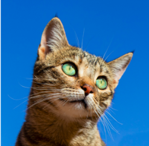
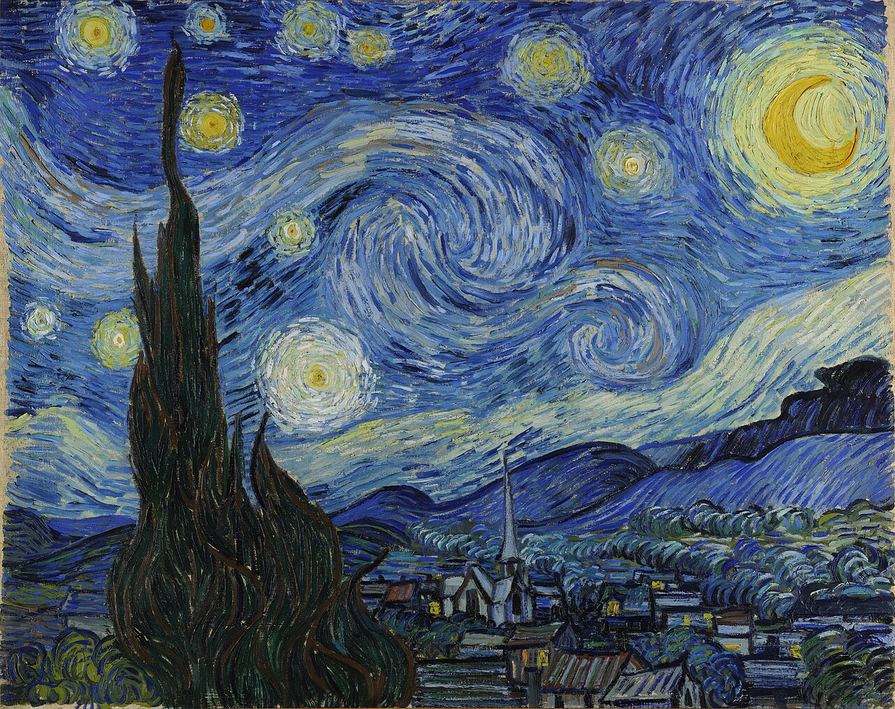
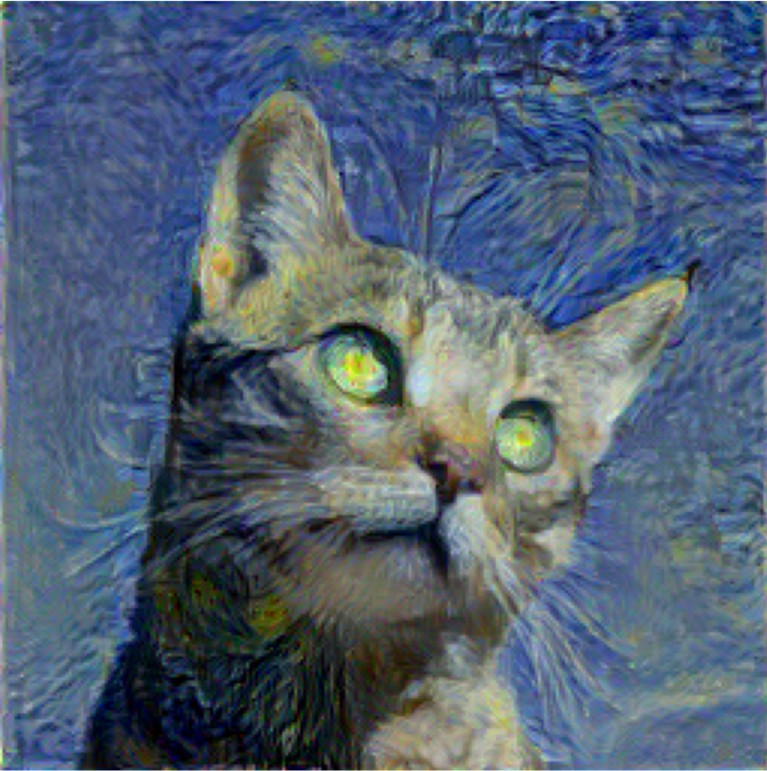

# **Neural Style Transfer with PyTorch**
Repaint any photograph in the brushstrokes of a painting you love — powered by a VGG19 network that was never trained to do this in the first place.

### **What this is**

This project takes a content image (say, a photo you took) and a style image (say, a Van Gogh painting), and generates a brand new image that keeps the structure of the first and borrows the texture, color, and brushwork of the second.

There's no dataset here, no training loop in the traditional sense, and no dedicated "style transfer network." That's what makes the algorithm interesting — it repurposes a classifier (VGG19, trained on ImageNet to recognize dogs and cars) and uses it as a feature extractor to measure two things: how similar is the content and how similar is the texture. Then it optimizes the pixels of an image directly until both losses are minimized.

<table align="center">
  <tr>
    <td align="center">
       
      <b>Content Image</b>
    </td>
    <td align="center">
       
      <b>Style Image</b>
    </td>
    <td align="center">
       
      <b>Stylized Output</b>
    </td>
  </tr>
</table>

## **How it actually works**

The core idea, from Gatys, Ecker & Bethge's "A Neural Algorithm of Artistic Style" (2015), is deceptively simple once you break it down:

**1. Borrow a pretrained CNN, but don't train it.**
VGG19 is loaded with ImageNet weights and frozen (.eval(), no gradient updates to the network). We're not trying to improve the model — we're using its intermediate activations as a feature space that already understands edges, textures, and shapes.

**2. Define "content" and "style" as different layers of the same network.**

LayerRoleWhyconv4_2ContentDeep enough to capture what is in the image (objects, layout), not exact pixel valuesconv1_1, conv2_1, conv3_1, conv4_1, conv5_1StyleA spread across shallow → deep layers, since style lives at multiple scales — brushstroke texture and broader color/pattern composition

**3. Turn style into math with a Gram matrix.**

Style isn't "what objects are present" — it's how features correlate with each other across the image, independent of their spatial position. The Gram matrix G = F·Fᵀ captures exactly that: which feature channels tend to activate together. Two images have the "same style" if their Gram matrices match.

**4. Optimize the image, not the network.**

This is the part that trips people up the first time you see it: the "trainable parameter" here isn't a set of weights — it's the pixels of the output image itself. Starting from a clone of the content image, gradients flow backward through VGG19 and directly update the pixel values, nudging them toward lower content + style loss on every step.

**5. Weight style layers unevenly.**
Earlier layers (conv1_1, conv2_1) get more weight than later ones (conv5_1) — early layers encode fine texture, and texture is what makes a stylized image actually look painterly rather than just recolored.
